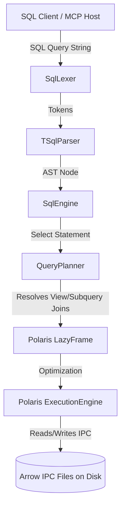

# Glacier.Sql Reference Manual & Documentation

Welcome to the **Glacier.Sql Reference Manual**. This document provides a comprehensive guide to using and developing with Glacier.Sql. It includes detailed explanations, SQL syntax definitions, code examples, and architectural notes for every supported command and concept.

---

## Table of Contents
1. [Core Architecture & Engine Design](#1-core-architecture--engine-design)
2. [Data Types](#2-data-types)
3. [Data Definition Language (DDL)](#3-data-definition-language-ddl)
4. [Data Manipulation Language (DML)](#4-data-manipulation-language-dml)
5. [Data Query Language (DQL)](#5-data-query-language-dql)
6. [SQL Views](#6-sql-views)
7. [Subqueries (Scalar & Relational)](#7-subqueries-scalar--relational)
8. [Transactions & Crash Recovery](#8-transactions--crash-recovery)
9. [SQL Triggers](#9-sql-triggers)
10. [Concurrency Locking Model](#10-concurrency-locking-model)
11. [Information Schema](#11-information-schema)

---

## 1. Core Architecture & Engine Design

Glacier.Sql bridges the gap between relational SQL queries and the high-performance columnar DataFrame operations of the **Glacier.Polaris** execution engine.



### Components
1. **SqlLexer & TSqlParser**: A Pratt and recursive-descent parser that processes SQL query strings into a typed Abstract Syntax Tree (AST) representing statements (`SqlStatement`) and expressions (`SqlExpression`).
2. **CatalogManager**: Tracks metadata for tables, columns, constraints, views, and triggers. It persists database state in a central `catalog.json` file.
3. **QueryPlanner**: Recursively compiles SQL AST queries into Polaris `LazyFrame` chains. It handles table resolution, view expansion, join key renaming, and subquery-to-join mapping.
4. **SqlEngine**: Manages execution state, locks tables, executes DDL and DML operations, manages transactions, and fires triggers.

---

## 2. Data Types

Glacier.Sql supports the following data types:

| SQL Type | Polaris Underlay | Description | Example Literal |
| :--- | :--- | :--- | :--- |
| **`INT`** | `Int32Series` | 32-bit signed integer | `123` |
| **`FLOAT`** | `Float64Series` | 64-bit double precision float | `123.45` |
| **`BIT`** | `BooleanSeries` | Logical true/false boolean | `1` (true), `0` (false) |
| **`VARCHAR`** | `Utf8StringSeries` | UTF-8 encoded text string | `'Hello World'` |
| **`DATETIME`** | `TimeSeries` | Unix epoch timestamp (long integers) | `'2026-05-26'` |

---

## 3. Data Definition Language (DDL)

DDL statements create, alter, and delete schemas.

### 3.1 CREATE TABLE
Creates a new physical table. Column definitions can contain inline constraints.

#### Syntax
```sql
CREATE TABLE table_name (
    column_name DATA_TYPE [PRIMARY KEY | UNIQUE | NOT NULL | CHECK (expr)],
    ...
)
```

#### Constraints
- **`PRIMARY KEY`**: Enforces that a column is both `NOT NULL` and `UNIQUE`.
- **`UNIQUE`**: Restricts duplicate values. Multiple `NULL` entries are permitted.
- **`NOT NULL`**: Rejects any insert or update containing `NULL` for this column.
- **`CHECK (expression)`**: Rejects writes if the expression evaluates to `FALSE`. If the expression evaluates to `NULL/UNKNOWN`, the write is allowed.

#### Example
```sql
CREATE TABLE customers (
    customer_id INT PRIMARY KEY,
    name VARCHAR NOT NULL,
    email VARCHAR UNIQUE,
    age INT CHECK (age >= 18)
);
```

---

### 3.2 DROP TABLE
Deletes a table definition from the catalog and deletes its backing file from disk.

#### Syntax
```sql
DROP TABLE table_name
```

#### Example
```sql
DROP TABLE customers;
```

---

### 3.3 ALTER TABLE ADD COLUMN
Appends a new column to an existing table. Existing rows in the table are padded with `NULL` values. The backing Arrow IPC file is rewritten.

#### Syntax
```sql
ALTER TABLE table_name ADD column_name DATA_TYPE [Constraints]
```

#### Example
```sql
ALTER TABLE customers ADD loyalty_points INT CHECK (loyalty_points >= 0);
```

---

### 3.4 ALTER TABLE DROP COLUMN
Removes a column from an existing table. The column is excluded from the new schema, and the backing Arrow IPC file is rewritten to discard the column's data.

#### Syntax
```sql
ALTER TABLE table_name DROP COLUMN column_name
```

#### Example
```sql
ALTER TABLE customers DROP COLUMN loyalty_points;
```

---

## 4. Data Manipulation Language (DML)

DML statements modify row data.

### 4.1 INSERT INTO
Inserts one or more rows into a table.

#### Positional Insertion
Inserts a row by mapping values directly to schema columns in order.
```sql
INSERT INTO customers VALUES (1, 'Alice', 'alice@test.com', 30);
```

#### Explicit Column Insertion
Inserts a row by specifying targets. Unspecified columns are initialized with `NULL`.
```sql
INSERT INTO customers (customer_id, name) VALUES (2, 'Bob');
```

#### INSERT INTO SELECT
Inserts the result set of a query into the target table.
```sql
INSERT INTO customer_archive SELECT * FROM customers WHERE age > 65;
```

---

### 4.2 UPDATE
Modifies existing rows matching a filter criteria. Multiple columns can be updated in a single statement.

#### Syntax
```sql
UPDATE table_name 
SET column1 = expression1, column2 = expression2 
[WHERE condition]
```

#### Example
```sql
UPDATE customers 
SET age = age + 1, email = 'updated_' + email 
WHERE customer_id = 1;
```

---

### 4.3 DELETE
Removes rows matching a filter criteria.

#### Syntax
```sql
DELETE FROM table_name 
[WHERE condition]
```

#### Example
```sql
DELETE FROM customers 
WHERE age < 18;
```

---

## 5. Data Query Language (DQL)

DQL statements query database records.

### 5.1 SELECT Statement Structure
Queries are translated into Polaris `LazyFrame` chains and executed.

#### Syntax
```sql
SELECT [TOP n] projection_list
FROM table_source
[JOIN join_source ON join_condition]
[WHERE filter_condition]
[GROUP BY group_columns]
[ORDER BY sort_column [ASC | DESC]]
```

---

### 5.2 SELECT Projections & Functions

#### Basic Projections
Projections can include direct column references, mathematical operators, and aliases.
```sql
SELECT name, age * 2 AS double_age FROM customers;
```

#### Aggregation Functions
Supported aggregations: `COUNT(*)`, `COUNT(col)`, `SUM(col)`, `AVG(col)`, `MIN(col)`, and `MAX(col)`.
- **NULL Handling**: `SUM`, `AVG`, `MIN`, and `MAX` ignore `NULL` entries. `COUNT(*)` counts all rows, whereas `COUNT(col)` counts only non-null values.

```sql
SELECT COUNT(*) AS total_customers, AVG(age) AS average_age FROM customers;
```

---

### 5.3 JOINS
Combines columns from multiple tables.

- **`INNER JOIN`**: Returns rows with matching values in both tables.
- **`LEFT JOIN`**: Returns all rows from the left table, with matching rows from the right table (padded with `NULL` if no match).
- **`CROSS JOIN`**: Returns the Cartesian product of the two tables.

#### Syntax
```sql
SELECT t1.name, t2.order_date
FROM customers t1
INNER JOIN orders t2 ON t1.customer_id = t2.customer_id;
```
> [!NOTE]
> Polaris requires the same column name for joins. If the join keys in the `ON` clause differ (e.g. `t1.id = t2.cust_id`), the query planner automatically renames the right key column in the underlying `LazyFrame` before joining.

---

### 5.4 ORDER BY & LIMIT

- **`ORDER BY`**: Sorts rows. Supports `ASC` (ascending, default) and `DESC` (descending).
- **`TOP n`**: Limits the number of returned rows.

#### Example
```sql
SELECT TOP 3 name, age 
FROM customers 
ORDER BY age DESC;
```

---

## 6. SQL Views

Views are virtual tables whose contents are defined by a query.

### 6.1 Creating & Dropping Views
```sql
-- Create View
CREATE VIEW active_customers AS 
SELECT customer_id, name, email 
FROM customers 
WHERE age >= 18;

-- Drop View
DROP VIEW active_customers;
```

### 6.2 View Expansion in Query Planner
When a query references a view, the query planner intercepts the source name, reads the view definition from the catalog, compiles the view's query to a `LazyFrame`, and inlines it in place of the table source.
```sql
SELECT * FROM active_customers WHERE name LIKE 'A%';
```

---

## 7. Subqueries (Scalar & Relational)

Subqueries compile to optimized columnar operations.

### 7.1 Scalar Subqueries
A subquery that returns a single value. It is compiled and evaluated first. The resulting value is injected as a constant literal `Expr.Lit` in the outer plan.
```sql
SELECT name FROM customers 
WHERE age = (SELECT MAX(age) FROM customers);
```

---

### 7.2 List Membership (`IN`)
Evaluated by compiling the inner subquery, collecting the results, and expanding it into a logical chain of equality checks (`OR`).

#### Subquery Membership
```sql
SELECT name FROM customers 
WHERE customer_id IN (SELECT customer_id FROM orders WHERE amount > 100);
```

#### Static List Membership
```sql
SELECT name FROM customers 
WHERE customer_id IN (1, 2, 3);
```

---

### 7.3 Existential Qualifiers (`EXISTS` / `NOT EXISTS`)
Existential subqueries are compiled using joins to avoid row-by-row scans.

#### Correlated EXISTS (Semi-Join)
The planner identifies correlation expressions (like `t_b.customer_id = t_a.customer_id`), removes them from the subquery's `WHERE` filter, and converts the operation into an inner **`Semi` Join** on the correlation key.
```sql
SELECT val FROM t_a 
WHERE EXISTS (SELECT * FROM t_b WHERE t_b.id = t_a.id AND score >= 90);
```

#### Correlated NOT EXISTS (Anti-Join)
Similar to `EXISTS`, but converts the operation into an inner **`Anti` Join**, returning only rows in the outer table that have no matches in the subquery.
```sql
SELECT val FROM t_a 
WHERE NOT EXISTS (SELECT * FROM t_b WHERE t_b.id = t_a.id);
```

---

## 8. Transactions & Crash Recovery

Glacier.Sql guarantees ACID properties using a shadowed table file log.

```text
1. Transaction Start (BEGIN TRANSACTION)
   ├── Backup catalog and metadata
   └── Lock target tables

2. DML Execution (INSERT, UPDATE, DELETE)
   ├── Read original table file
   ├── Write modifications to a temporary shadow file (.tmp)
   └── Route subsequent reads to shadow files

3. Transaction End
   ├── COMMIT   ──> Swap shadow files to primary, delete backups
   └── ROLLBACK ──> Delete shadow files, restore original state
```

### 8.1 Transaction Syntax
```sql
BEGIN TRANSACTION;
INSERT INTO orders VALUES (10, 50.0);
UPDATE inventory SET stock = stock - 10 WHERE item_id = 1;
COMMIT; -- Or ROLLBACK;
```

### 8.2 Crash Recovery
If the server crashes during a transaction:
1. On startup, `CatalogManager.Load()` checks for any remaining transaction logs.
2. If incomplete transactions are found, it rolls them back:
   - Deletes all temporary shadow files.
   - Restores catalog states from the backup configurations.
   - Restores database integrity.

---

## 9. SQL Triggers

Triggers are persistent procedural actions executed automatically in response to DML operations (`INSERT`, `UPDATE`, `DELETE`).

### 9.1 AFTER Triggers
Executes *after* the DML statement is applied. The trigger can query virtual tables `inserted` and `deleted` to inspect the changes.
```sql
CREATE TRIGGER audit_log ON orders 
AFTER INSERT 
AS 
INSERT INTO order_history 
SELECT id, qty, 'INSERTED' FROM inserted;
```

---

### 9.2 INSTEAD OF Triggers
Overrides the DML statement. The original modification is not applied to the table; instead, only the trigger's script is executed.
```sql
CREATE TRIGGER routing_trig ON orders
INSTEAD OF INSERT
AS
INSERT INTO high_value_orders SELECT * FROM inserted WHERE amount >= 1000;
```

---

### 9.3 Trigger Cascading
If a trigger modifies another table, it can fire triggers defined on that table. Glacier.Sql supports recursive cascading triggers.

```text
INSERT into Table A 
  └── Fired Trigger A ──> INSERT into Table B
                            └── Fired Trigger B ──> INSERT into Table C
```

---

### 9.4 Transaction Integration
If a DML statement runs within an active transaction, all modifications made by its triggers (e.g. audit logging, inserts into shadow tables) are written to the transaction's shadow files.
If the transaction is rolled back, all trigger modifications are rolled back.

---

## 10. Concurrency Locking Model

To ensure isolation across asynchronous operations, Glacier.Sql uses a custom locking model.

### 10.1 Thread-Independent RW Lock
C#'s `ReaderWriterLockSlim` enforces thread-affinity, meaning the thread that acquires a lock must be the one that releases it. Because .NET's `async/await` tasks can resume on different thread pool threads, using `ReaderWriterLockSlim` causes deadlocks or exceptions in async pipelines.

To resolve this, Glacier.Sql implements `ThreadIndependentReaderWriterLock`. It manages active locks using an async-friendly semaphore queue, allowing lock acquisition and release to span across multiple thread contexts safely.

### 10.2 Lock Escalation
- **Shared Read Locks**: Acquired during `SELECT` statements.
- **Exclusive Write Locks**: Acquired during `INSERT`, `UPDATE`, `DELETE`, `CREATE`, `DROP`, and `ALTER TABLE` statements.
- **Transaction Scope**: Shared and exclusive locks are held for the duration of a transaction and released only when `COMMIT` or `ROLLBACK` is executed.

---

## 11. Information Schema

Glacier.Sql exposes transient system tables that can be queried to inspect active metadata.

### 11.1 INFORMATION_SCHEMA.TABLES
Exposes a list of tables registered in the database catalog.

#### Schema
- `TABLE_NAME` (`VARCHAR`)

#### Example
```sql
SELECT TABLE_NAME 
FROM INFORMATION_SCHEMA.TABLES 
WHERE TABLE_NAME LIKE 'test%';
```

---

### 11.2 INFORMATION_SCHEMA.COLUMNS
Exposes column metadata for all tables.

#### Schema
- `TABLE_NAME` (`VARCHAR`)
- `COLUMN_NAME` (`VARCHAR`)
- `DATA_TYPE` (`VARCHAR`)
- `IS_NULLABLE` (`VARCHAR` - `'YES'` or `'NO'`)

#### Example
```sql
SELECT COLUMN_NAME, DATA_TYPE, IS_NULLABLE 
FROM INFORMATION_SCHEMA.COLUMNS 
WHERE TABLE_NAME = 'customers';
```
